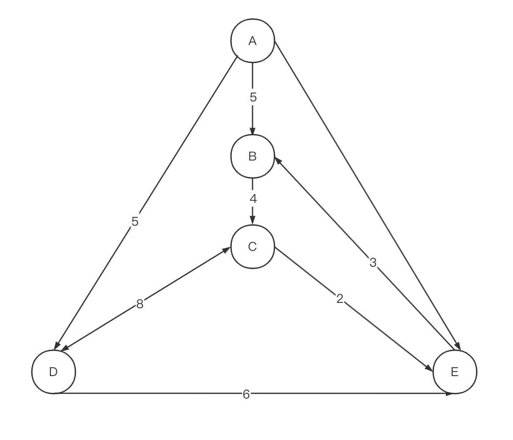

# 第一部分

问题: 当地的通勤铁路服务于新西兰的一些城镇。由于货币方面的考虑，所有的轨道都是`单向的`。

比如：

一条「凯塔亚到因弗卡吉尔」的路线并不意味着只存在一条「因弗卡吉尔到凯塔亚」的路线。

事实上，即使这两条路线都存在，它们`是不同的，不一定是相同的距离`!

这个问题的目的是帮助铁路公司为其客户提供路由信息。

特别地任务

1. ==你要计算沿着一条路线的距离==
2. ==两个城镇之间不同路线的数量==
3. ==两个城镇之间最短的路线==

- 输入
  - 一个有向图，其中一个节点代表一个城镇，一条边代表两个城镇之间的路线。边的权重表示距离在两个城镇之间。一条给定的路线只会出现一次，并且for给定的路线，起点和终点城镇不会是同一个城镇。

- 输出
  - 对于测试输入1 ~ 5，如果没有这样的路由存在，输出"NO SUCH ROUTE"。否则，按照给出的路线进行;不要做任何额外的停留
    例如，第一个问题意味着从A市出发，然后直接前往B市(距离5)，然后直接到C市(距离4)。

1. 路线A‐B‐C的距离。
2. 路线A-D的距离。
3. 路线A‐D‐C的距离。
4. 路线A‐E‐B‐C‐D的距离。
5. 路线A‐E‐D的距离。
6. 从C站出发至C站结束，最多停靠3站的班次数。在下面的样本数据中，有两个这样的行程: C‐D‐C(2站)。C-E-B-C(3站)。
7. 从A点开始到C点结束一共停4站的行程数。在下面的样本数据，有三个这样的行程: A-C(经B,C,D); A-C(通过D,C,D);A-C(通过D,E,B)。
8. 从A到C的最短路线的长度(以行驶的距离表示)。
9. 从B到B的最短路线的长度(以行驶的距离表示)。
10. 从C到C的距离小于30的不同路线的个数。在样本数据，行程为:CDC, CEBC, CEBCDC, CDCEBC, CDEBC, CEBCEBC，CEBCEBCEBC。

- 测试输入:

对于测试输入，城镇使用字母表的前几个字母命名从A到D, 两个城镇(A到B)之间距离为5的路线
表示为AB5。

图:AB5, BC4, CD8, DC8, DE6, AD5, CE2, EB3, AE7

预期的输出:

输出#1: 9
输出#2: 5
输出#3: 13
输出#4: 22
输出#5: NO SUCH ROUTE
输出#6: 2
输出#7: 3
输出#8: 9
输出#9: 9
输出#10: 7

最小功能单元1：计算指定路线距离

- 能接受正常输入

- 判断路径是否可达
  - 如果可达 
    - 计算距离信息
  - 不可达，返回no such route

- 确定路线点的前驱后继关系

最小功能单元2：计算X-X的最短距离

- 找到x-x之间的所有可达路线

- 计算所有路线中最短距离的路

最小功能单元3:  计算X-X的指定｜大于｜小于距离的路线条数

- 找到x-x的所有路线后，根据条件计算所有满足条件的路线数量

# 第二部分

火车沿着任何给定的路线行驶，都会在一个车站停留两分钟。
假设一个单位的距离需要1分钟，部分的10个问题

1已被添加到包括持续时间。

1. 路由A‐B‐C的持续时间。
2. 路由A‐D的持续时间。
   3.路由A‐D‐C的持续时间。
3. 路由A‐E‐B‐C‐D的持续时间。
4. 路由A‐E‐D的持续时间。
5. 从C点出发到C点结束，最长持续时间为
   30分钟。在下面的样本数据中，有四种这样的行程:C‐D‐C (18)， C‐E‐
   B‐C (13)， C‐D‐E‐B‐C(27)和C‐E‐B‐C‐E‐B‐C (28)
6. 从A点开始到C点结束的行程数，持续时间正好是30。
   在下面的样本数据中，有一个这样的行程:A‐D‐C‐E‐B‐C
7. 从A到C最快路线的持续时间。
8. 从B点到B点最快路线的持续时间。
9. 从C到C且持续时间小于35的不同路由的个数。在
   样本数据，行程为:CDC, CEBC, CEBCDC, CDCEBC, CDEBC, CEBCEBC。
   预期的输出:
   输出#1:11
   输出#2:5
   输出#3:15
   输出# 4,28
   输出#5:NO SUCH ROUTE
   输出#6:4
   输出#7:1
   输出# 8,11
   输出#9:13
   输出#10:6
