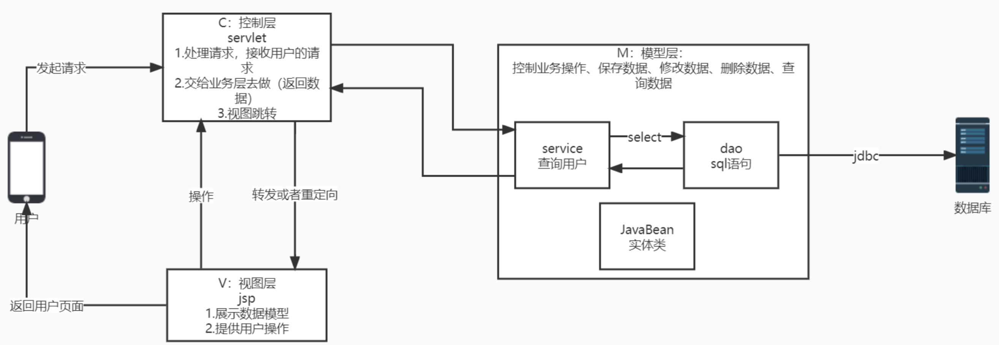
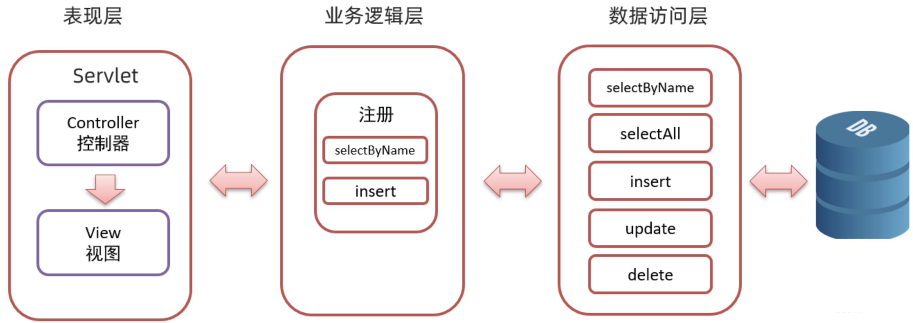

# 架构学习

## MVC架构

### 1. 架构介绍

MVC全名是Model-View-Controller即「模型(Model)、视图(View)、控制器(Controller)」，一种软件设计典范，用一种业务逻辑、数据、界面显示分离的方法组织代码，将业务逻辑聚集到一个部件里面，在改进和个性化定制界面及用户交互的同时，不需要重新编写业务逻辑。MVC被独特的发展起来用于映射传统的输入、处理和输出功能在一个逻辑的图形化用户界面的结构。

- 模型层Model

代表应用程序的`数据结构`和相关的业务逻辑。通常模型包含`数据库架构`以及`数据访问层`代码。

- 视图层View

用于呈现`模型中的数据`,通常是HTML 界面，也可以是 PDF、图片等等。视图只负责显示，不包含逻辑。

- 控制器Controller

用于处理请求和响应用户操作。控制器获取输入,调用模型和视图处理逻辑,最终返回一个结果。

```
src
+- main
   +- java
      +- com.thoughtworks.shopbackend
         +- Application.java          // SpringBoot启动类
         +- controller                    // 控制器层
         |  +- UserController.java      
         |
         +- service                       // 服务层    
         |  +- UserService.java          
         |
         +- mapper                        // 数据访问层  
         |  +- UserMapper.java
         |
         +- dto                           // 数据传输对象
         |  +- UserDto.java
         |  
         +- vo                            // 视图对象
         |  +- UserVo.java  
         | 
         |- components
             +- config                        // 配置类
             |  +- WebConfig.java            
             |  
             +- exception                     // 异常类 
             |  +- UserNotExistException.java
             |  
             +- utils                         // 工具类
```

> 一个简单的 MVC 交互过程如下:

1. 用户访问网站URL,请求被发送到 Controller
2. Controller调用Model获取需要的信息
3. Controller把Model里的数据传递到 View
4. View使用Model 数据渲染模板,生成 HTML 页面
5. HTML 页面响应给用户







### 2. 架构优劣

> 优势

1. 低耦合: 模型、视图、控制器三者相互独立,只通过接口相连,修改一层不影响其他层,方便维护和扩展。
2. 高内聚: 每一层只专注于自己的任务, Model专注业务,View专注显示,Controller专注控制。
3. 可重用: 每一层可以被其他应用重用,视图和模型层尤其如此。
4. 易于维护: MVC架构让应用程序的开发和维护更加容易,开发人员只需关注应用程序的一部分。

> 劣势

1. 对AJAX支持不太友好: MVC模型依赖表单提交和页面跳转,不太容易实现AJAX。
2. URL与视图耦合严重: URL直接映射到具体视图
3. 复杂项目难以管理: 项目复杂时，Controller容易过于臃肿，Model层也会很庞大。

> 使用场景

1. 数据驱动的网站: 内容主要由数据库提供,视图只负责数据展示,非常适合MVC。如新闻网站、博客网站等。
2. 表单驱动的网站: 网站主要用于处理表单提交,业务逻辑比较简单。MVC可以很好的将输入、验证、存储分离开来。
3. 响应请求驱动的网站: 网站主要用于响应客户请求,调用不同的业务模型和视图。
4. 需要频繁修改和迭代的项目: MVC架构的低耦合性,便于功能修改和扩展,很适合需要频繁变动的项目。
5. 小规模项目: MVC对小规模项目非常合适。

## DDD架构

### 1. 架构介绍

DDD(Domain-Driven Design,领域驱动设计)是一种软件开发方法,主要用于解决复杂问题域的软件开发。

DDD强调以领域模型为中心,根据领域模型来设计软件架构和编写代码。

> DDD分为四个层次:

1. 领域层(Domain Layer): 包含领域模型和业务规则,是`DDD的核心`。领域模型通过实体、值对象、聚合等概念来`描述业务概念及业务规则`。
2. 领域服务层(Domain Service Layer): 包含相关的领域服务,用来`实现领域对象的业务逻辑`。`领域服务依赖领域对象,不依赖基础设施和界面`。
3. 应用层(Application Layer):主要包含应用服务,用来实现用例和工作流。应用服务依赖领域服务,不直接依赖基础设施。应用层是`外部访问DDD的入口`。
4. 基础设施层(Infrastructure Layer): 包含基础设施,如数据库、消息队列等。`基础设施被上层应用和领域层使用,提供技术支持`。DDD还提出了很多其他概念,如仓储(Repository)、工厂(Factory)、聚合(Aggregate)等。

```
src
+- main
   +- java
      +- com.thoughtworks.shopbackend    
         +- domain                         // 领域层
         |  +- model                      // 领域模型
         |  |  +- User.java              
         |  |  +- UserAddress.java   
         |  |  
         |  +- service                  // 领域服务     
         |     +- UserService.java                          
         |                          
         +- application                 // 应用层  
         |  +- UserApplicationService.java                  
         |                             
         +- infrastructure              // 基础设施层  
         |  +- repository             // 持久层
         |  |  +- UserRepository.java 
         |                       
         +- api                  // API接口       
         |  +- Controller.java
         |  
         +- Application.java
```

### 2. 架构优劣

> 优势

1. 以业务需求为中心: DDD注重业务,以领域模型为核心,符合业务思维方式。
2. 高内聚低耦合: DDD将业务规则、业务逻辑和基础技术分离,各层高内聚且通过抽象耦合。
3. `可测试性好`: 不同层之间的依赖关系清晰,方便进行单元测试和集成测试。
4. 可扩展性好: 居中分离的架构,方便进行扩展,同时不影响其他模块。
5. 有利于团队协作: 领域模块可聚焦领域层,技术模块可聚焦基础设施层,由应用层连接二者。

> 劣势

1. 学习曲线高: DDD涉及的概念和方法较多,需要投入大量时间去学习和理解。
2. 项目初期成本高: DDD的分层设计增加了项目的复杂度和难度,初期投入较大。
3. `依赖关系较复杂`: 分层设计导致的对象与对象之间的依赖关系较为复杂。

>使用场景

1. 领域复杂性高的系统: DDD专注领域建模,适用于业务规则和流程`变化频繁`的复杂系统。
2. 长期演进的系统 :DDD侧重业务驱动和可扩展,更容易应对业务变化,适用于需要`长期演进的系统`。 
3. 大型项目: DDD提倡分层和松耦合设计,更加适用于较大的项目,可以很好地把系统划分成相对独立的模块。
4. 需要高质量和高可测试性的系统:DDD注重代码的内聚和抽象,有利于编写`高质量和高可测试性的代码`。

